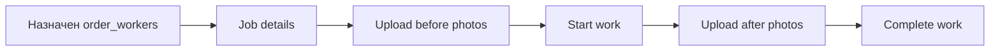

# ZipDone — мобильное приложение Worker

> Репозиторий: `ZipDone-Flutter-woker`  
> Package: `zipdone_worker`, application ID: `com.zipdone.worker`  
> Обновлено: 2026-07-11

## Стек

Flutter/Dart 3.6+, Riverpod 3, GoRouter 17, Supabase Flutter, Firebase Messaging, EN/AR localization.

## Маршруты

| Route | Назначение |
|---|---|
| `/login`, `/auth/otp`, `/auth/invite/:token` | Phone OTP и invitation |
| `/auth/onboarding/profile` | Завершение профиля |
| `/home` | Home и новые назначения |
| `/booking` | Сейчас placeholder будущего job list |
| `/support` | Сейчас mock UI |
| `/notifications` | In-app inbox |
| `/account/*` | Профиль и настройки |

## Auth

Returning login проверяется через `check_auth_phone_exists` и `check_auth_worker_phone`. Новый worker создаётся только по действующему worker invite. После OTP профиль дополняется и invitation связывает worker с компанией.

## Доступ к данным

Worker должен видеть только:

- свой `profiles`/`workers`;
- собственное company/team membership;
- заказы, где он присутствует в `order_workers`;
- связанные безопасные данные клиента/адреса, разрешённые RLS;
- собственные уведомления и preferences;
- фотографии назначенных заказов.

## Целевой job lifecycle

Все переходы статусов должны выполняться через backend RPC с проверкой assignment и допустимого текущего статуса. Прямой клиентский UPDATE общего статуса заказа не должен становиться контрактом Worker.

Фотографии:

- bucket `order-photos`;
- path `{order_id}/...`;
- `order_photos.photo_type`: `before` или `after`;
- запись разрешена только назначенному worker;
- UI обязан обрабатывать offline/retry и не дублировать metadata.

## Уведомления

Push module реализован. `worker_assigned` открывает `/booking`, пока отдельного job detail нет; `new_cleaning_request` ведёт на `/home`. Payload Client игнорируется. Подробнее: [уведомления](../notifications.md).

## Реализовано (фаза 1, аудит 2026-07-11)

| Область | Статус |
|---|---|
| Auth (Phone OTP, invite, onboarding, blocked) | ✅ |
| Profile / Account Info / email change | ✅ |
| Notifications inbox + settings + FCM push | ✅ |
| Home / Booking / Support / Orders | ❌ placeholder / mock |
| Order execution, photos, timers | ❌ |
| Storage API в коде | ❌ |
| Edge Functions (прямые вызовы) | ❌ |

### RPC, используемые сейчас

| RPC | Назначение |
|---|---|
| `get_invitation_by_token` | Валидация invite |
| `check_auth_phone_exists` | Returning login |
| `check_auth_worker_phone` | Worker gate |
| `accept_company_invitation` | Привязка к компании |
| `check_auth_email_exists`, `prepare_worker_auth_email_change` | Смена email |
| `mark_notification_read`, `mark_all_notifications_read` | Inbox |
| `upsert_device_token`, `remove_device_token` | FCM lifecycle |

### Таблицы

`profiles`, `workers`, `notifications`, `notification_preferences` — только они используются в коде.

App-specific детали: `ZipDone-Flutter-woker/docs/` (`worker-auth-flow.md`, `screens.md`, `push-notifications.md`).
