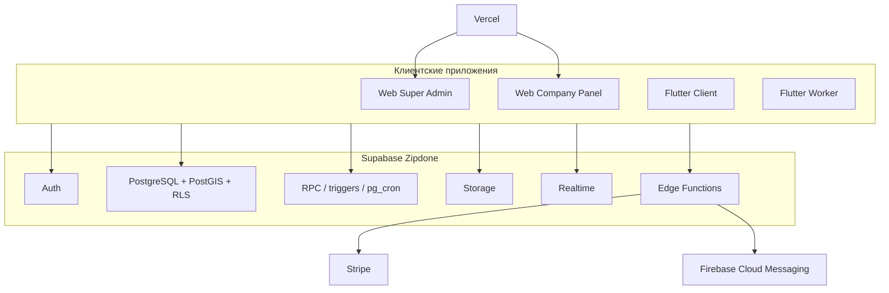
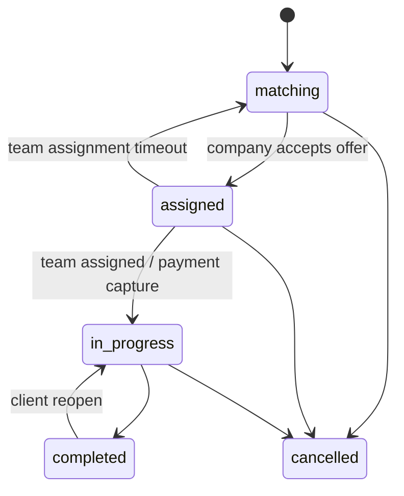

# ZipDone — архитектура экосистемы

> Обновлено: 2026-07-11

## Общая схема

Приложения не имеют отдельного application server. Доступ к данным выполняется через Supabase Data API/RPC с обязательным RLS. Операции, требующие секретов или повышенных полномочий, выполняются Edge Functions либо функциями в закрытой схеме `private`.

## Репозитории

| Репозиторий | Стек | Ответственность |
|---|---|---|
| `ZipDone-web` | Vite 8, React 19, React Router 7, Tailwind 4 | Landing, auth, Admin, Company |
| `ZipDone-Flutter-client` | Flutter/Dart, Riverpod 3, GoRouter 17 | Заказчик: адреса, booking, оплаты, диспуты |
| `ZipDone-Flutter-woker` | Flutter/Dart, Riverpod 3, GoRouter 17 | Клинер: профиль, уведомления; рабочий lifecycle развивается |
| `ZipDone-docs` | Markdown, Obsidian, MkDocs Material | Общие контракты и архитектура |

## Роли и владение данными

| Роль | Основные сущности | Канал входа |
|---|---|---|
| `admin` | Все операционные сущности через admin policies/RPC | Email/password |
| `company` | Своя компания, команды, воркеры, зоны, заказы, финансы | Phone OTP + invite/onboarding |
| `client` | Свой профиль, адреса, заказы, оплаты, диспуты | Phone OTP; новый номер только по client invite |
| `worker` | Свой профиль, назначенные заказы, фотографии | Phone OTP; новый номер только по worker invite |

## Основные доменные потоки

### Заказ

Мэтчинг учитывает service zone, расписание, рейтинг, OrderScore, приглашённого клиента, расстояние и ёмкость активной команды (`member_count >= cleaners_requested`).

### Оплата

Клиент сохраняет карту через Stripe SetupIntent. При создании заказа PaymentIntent авторизуется с `capture_method=manual`; capture выполняется при переходе к исполнению. Stripe webhook синхронизирует `payments`, `transactions`, refunds и Connect-статус компании.

### Уведомления

Доменные события создают строки `notifications`. In-app клиенты читают их через Supabase Realtime. Push доставляется через `send-push` → FCM с маршрутизацией по `target_app`.

## Системные ограничения

- Единственный допустимый Supabase project ref: `nlpswsajjexnaqpwyiph`.
- Бизнес-таймзона: `Asia/Dubai`; валюта: AED.
- EN/AR и RTL обязательны для пользовательских интерфейсов.
- Lookup-таблицы и slug используются вместо PostgreSQL ENUM.
- Service role и внешние секреты запрещены в frontend/mobile.
