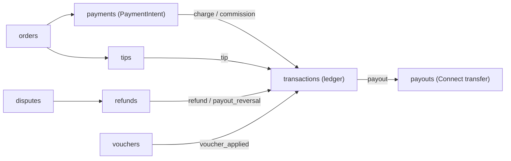
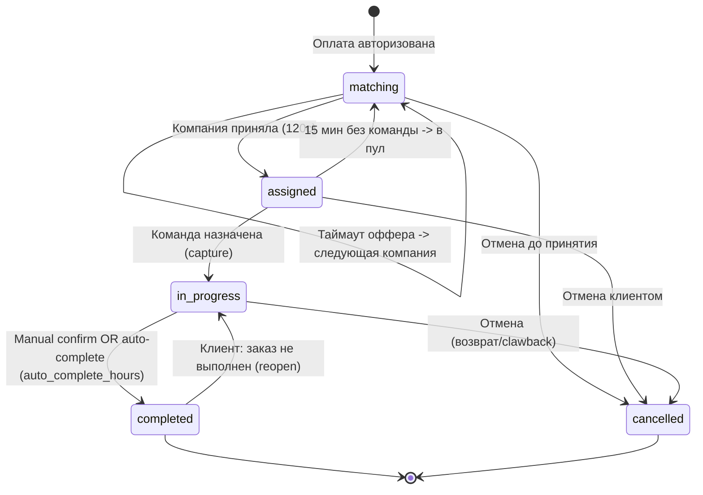
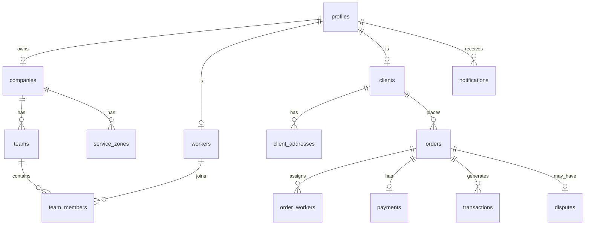

# ZipDone — Схема базы данных (Production)

> **Источник:** live dump Supabase PostgreSQL 17.6 (проект `nlpswsajjexnaqpwyiph`, eu-west-1)  
> **Дата снимка:** 2026-07-11 22:07:53 (UTC+3)  
> **Версия документа:** 4.0  
> Стек: **Supabase (PostgreSQL 17 + PostGIS + Auth + Realtime + Storage + pg_cron)**  
> Регион/валюта: **ОАЭ, AED**, таймзона `Asia/Dubai`  
> Локализация: **EN/AR** через справочники `slug` + `*_translations`

## Статус деплоя

| Параметр | Значение |
|----------|----------|
| Проект | **Zipdone** (`nlpswsajjexnaqpwyiph`), регион eu-west-1 |
| PostgreSQL | 17.6.1.127 |
| Применено миграций (remote) | 89 |
| Файлов миграций (local repo) | 64 |
| Таблиц в `public` | 62 (RLS на всех) |
| Sequences | 2 (`order_number_seq`, `dispute_number_seq`) |
| Materialized views | 3 (закрыты от Data API) |
| Функций (`public` + `private`) | 102 (77 + 25) |
| Триггеров | 33 |
| Cron-задач | 7 |
| Storage buckets | 6 |
| Notification templates | 11 event types |
| PG ENUM types | **нет** — вместо них lookup-таблицы + CHECK constraints |

> Все функции имеют фиксированный `search_path`; materialized views недоступны через anon/authenticated.

## Оглавление

1. [Расширения и схемы](#расширения-и-схемы)
2. [Миграции](#миграции)
3. [Справочники (lookup) и псевдо-enum](#справочники-lookup-и-псевдо-enum)
4. [platform_settings](#platform_settings)
5. [notification_templates](#notification_templates)
6. [Таблицы public](#таблицы-public)
7. [Sequences](#sequences)
8. [Функции](#функции)
9. [Триггеры](#триггеры)
10. [Materialized views](#materialized-views)
11. [Индексы](#индексы)
12. [RLS-политики](#rls-политики)
13. [pg_cron](#pg_cron)
14. [Storage](#storage)
15. [Бизнес-контекст](#бизнес-контекст)

---

## Расширения и схемы

### Установленные расширения

| Extension | Schema | Version |
|-----------|--------|---------|
| postgis | extensions | 3.3.7 |
| pg_cron | pg_catalog | 1.6.4 |
| btree_gist | extensions | 1.7 |
| pgcrypto | extensions | 1.3 |
| uuid-ossp | extensions | 1.1 |
| pg_stat_statements | extensions | 1.11 |
| supabase_vault | vault | 0.3.1 |
| plpgsql | pg_catalog | 1.0 |

### Схемы приложения

| Schema | Назначение |
|--------|------------|
| `public` | Все операционные таблицы, RPC, materialized views |
| `private` | RLS helpers, finance/matching/notification helpers — не exposed в Data API |
| `extensions` | PostGIS и прочие расширения |
| `cron` | pg_cron metadata (`cron.job`) |

---

## Миграции

### Remote (production) — 89 записей

| Version | Name |
|---------|------|
| 20260610111749 | extensions |
| 20260610111817 | lookups_i18n |
| 20260610111848 | core_users |
| 20260610111906 | geo_schedule |
| 20260610111916 | teams_addresses |
| 20260610111937 | orders |
| 20260610112000 | finance |
| 20260610112011 | disputes |
| 20260610112027 | comms |
| 20260610112038 | score_audit_ratings |
| 20260610112104 | functions_triggers |
| 20260610112126 | rls_helpers_and_loops |
| 20260610112149 | rls_policies |
| 20260610112200 | views |
| 20260610112212 | cron |
| 20260610112244 | seed |
| 20260610112306 | harden_security |
| 20260610115217 | storage |
| 20260610115259 | matching_rpc |
| 20260610115346 | seed_test_users |
| 20260610121344 | db_completion_schema |
| 20260610121354 | auth_onboarding |
| 20260610121438 | matching_cron_lifecycle |
| 20260610121440 | security_hardening |
| 20260610121454 | borrow_worker |
| 20260610121504 | rpc_lockdown |
| 20260610121516 | rpc_lockdown_v2 |
| 20260610133240 | site_media |
| 20260610145305 | auth_email_lookup |
| 20260610150622 | seed_test_orders_rls |
| 20260610152320 | web_company_signup |
| 20260610171514 | platform_settings_public_read |
| 20260611133424 | company_onboarding |
| 20260611134639 | normalize_phone_e164 |
| 20260611134712 | handle_new_user_normalize_phone |
| 20260611141954 | auth_phone_lookup |
| 20260611142010 | partner_phone_auth |
| 20260611144954 | seed_demo_marketplace |
| 20260611145632 | fix_seed_phone_auth |
| 20260611150959 | team_members_lead |
| 20260611151652 | fix_storage_rls_foldername |
| 20260611151713 | fix_storage_rls_objects_name |
| 20260611160413 | company_panel_rpcs |
| 20260611160444 | realtime_order_company_offers |
| 20260611162133 | resolve_dispute_rpc |
| 20260611163543 | add_dispute_attachments_rpc |
| 20260611163650 | company_client_profile_rls |
| 20260611165130 | company_worker_management |
| 20260611171132 | company_finance_dashboard |
| 20260613091925 | admin_orders_lifecycle |
| 20260613091929 | realtime_orders |
| 20260613103356 | notifications_read_rls |
| 20260613104349 | company_registration_welcome_notification |
| 20260613105216 | notification_pipeline |
| 20260613105237 | notification_pipeline_core |
| 20260613105247 | notification_pipeline_queue |
| 20260613105257 | notification_pipeline_notifiers_1 |
| 20260613105303 | notification_pipeline_notifiers_2 |
| 20260613105307 | notification_pipeline_triggers |
| 20260613110235 | company_dashboard |
| 20260613111149 | fix_company_dashboard_workers |
| 20260613112116 | dispute_resolved_notification_templates |
| 20260613112121 | dispute_resolved_notification_functions |
| 20260613112132 | dispute_resolved_notify_opened |
| 20260613112138 | dispute_resolved_notify_resolved |
| 20260613113213 | company_profile |
| 20260613113626 | auto_complete_hours_setting |
| 20260613114954 | fix_companies_guard_trigger_security |
| 20260613115214 | fix_open_disputes_count |
| 20260613123312 | notifications_admin_rls_fix |
| 20260613123333 | admin_dispute_opened_notify_admins |
| 20260613123911 | resolve_dispute_voucher_client_only |
| 20260613152539 | db_cleanup_audit |
| 20260614201322 | check_auth_worker_phone |
| 20260615180643 | worker_profile_email_change |
| 20260615184358 | client_auth_rpc |
| 20260619204944 | order_ratings_client_rls |
| 20260709141707 | companies_client_order_select |
| 20260709141936 | client_order_workers_select |
| 20260709143000 | fix_client_order_rls_recursion |
| 20260710113250 | team_stats_denormalization |
| 20260710140500 | push_delivery_pipeline |
| 20260710145200 | push_delivery_config |
| 20260710174557 | reopen_order_rpc |
| 20260711070655 | client_stripe_payment_methods |
| 20260711070844 | payments_client_select |
| 20260711115815 | find_matching_companies_team_capacity |
| 20260711121827 | client_create_order_dispute |
| 20260711123757 | admin_matching_exhausted |

> Remote содержит больше записей, чем файлов в репозитории: часть локальных миграций при деплое разбивалась на несколько шагов (например, `notification_pipeline` → 5 частей).

### Локальный репозиторий (`supabase/migrations/`) — 64 файлов

| Файл | Содержимое |
|------|-----------|
| `20260610000001_extensions.sql` | см. имя файла |
| `20260610000002_lookups_i18n.sql` | см. имя файла |
| `20260610000003_core_users.sql` | см. имя файла |
| `20260610000004_geo_schedule.sql` | см. имя файла |
| `20260610000005_teams_addresses.sql` | см. имя файла |
| `20260610000006_orders.sql` | см. имя файла |
| `20260610000007_finance.sql` | см. имя файла |
| `20260610000008_disputes.sql` | см. имя файла |
| `20260610000009_comms.sql` | см. имя файла |
| `20260610000010_score.sql` | см. имя файла |
| `20260610000011_audit.sql` | см. имя файла |
| `20260610000012_ratings.sql` | см. имя файла |
| `20260610000013_functions_triggers.sql` | см. имя файла |
| `20260610000014_rls.sql` | см. имя файла |
| `20260610000015_views.sql` | см. имя файла |
| `20260610000016_cron.sql` | см. имя файла |
| `20260610000017_seed.sql` | см. имя файла |
| `20260610140000_storage.sql` | см. имя файла |
| `20260610140001_seed_test_users.sql` | см. имя файла |
| `20260610140002_matching_rpc.sql` | см. имя файла |
| `20260610160000_db_completion_schema.sql` | см. имя файла |
| `20260610160001_auth_onboarding.sql` | см. имя файла |
| `20260610160002_matching_cron_lifecycle.sql` | см. имя файла |
| `20260610160003_security_hardening.sql` | см. имя файла |
| `20260610160004_borrow_worker.sql` | см. имя файла |
| `20260610160005_rpc_lockdown.sql` | см. имя файла |
| `20260610170000_site_media.sql` | см. имя файла |
| `20260610180000_auth_email_lookup.sql` | см. имя файла |
| `20260610190000_seed_test_orders.sql` | см. имя файла |
| `20260610210000_platform_settings_public_read.sql` | см. имя файла |
| `20260611120000_company_onboarding.sql` | см. имя файла |
| `20260611145632_fix_seed_phone_auth.sql` | см. имя файла |
| `20260611150959_team_members_lead.sql` | см. имя файла |
| `20260611160414_realtime_order_company_offers.sql` | см. имя файла |
| `20260611170000_normalize_phone_e164.sql` | см. имя файла |
| `20260611180000_partner_phone_auth.sql` | см. имя файла |
| `20260611190000_auth_phone_lookup.sql` | см. имя файла |
| `20260611200000_seed_demo_marketplace.sql` | см. имя файла |
| `20260611220000_fix_storage_rls_foldername.sql` | см. имя файла |
| `20260611230000_company_panel_rpcs.sql` | см. имя файла |
| `20260612120000_resolve_dispute_rpc.sql` | см. имя файла |
| `20260612140000_add_dispute_attachments_rpc.sql` | см. имя файла |
| `20260612150000_company_client_profile_rls.sql` | см. имя файла |
| `20260613120000_company_worker_management.sql` | см. имя файла |
| `20260613153000_admin_dispute_opened_notify_admins.sql` | см. имя файла |
| `20260613154500_notifications_admin_rls_fix.sql` | см. имя файла |
| `20260613160000_resolve_dispute_voucher_client_only.sql` | см. имя файла |
| `20260613180000_company_finance_dashboard.sql` | см. имя файла |
| `20260614000000_admin_orders_lifecycle.sql` | см. имя файла |
| `20260614100000_realtime_orders.sql` | см. имя файла |
| `20260614120000_notifications_read_rls.sql` | см. имя файла |
| `20260614140000_company_registration_welcome_notification.sql` | см. имя файла |
| `20260614150000_notification_pipeline.sql` | см. имя файла |
| `20260614160000_company_dashboard.sql` | см. имя файла |
| `20260614170000_fix_company_dashboard_workers.sql` | см. имя файла |
| `20260614180000_dispute_resolved_notification.sql` | см. имя файла |
| `20260614190000_auto_complete_hours_setting.sql` | см. имя файла |
| `20260614200000_company_profile.sql` | см. имя файла |
| `20260614220000_fix_open_disputes_count.sql` | см. имя файла |
| `20260614230000_db_cleanup_audit.sql` | см. имя файла |
| `20260709143000_fix_client_order_rls_recursion.sql` | см. имя файла |
| `20260710103742_team_stats_denormalization.sql` | см. имя файла |
| `20260711150000_find_matching_companies_team_capacity.sql` | см. имя файла |
| `20260711160000_admin_matching_exhausted.sql` | см. имя файла |

---

## Справочники (lookup) и псевдо-enum

PostgreSQL ENUM **не используются**. Статусы и роли — таблицы `slug` + `*_translations`. Операционные поля — `text` + CHECK.

### Lookup-таблицы (production seed)

| Lookup | Значения (slug) |
|--------|-----------------|
| `roles` | admin, client, company, worker |
| `order_statuses` | matching, assigned, in_progress, completed, cancelled |
| `profile_statuses` | active, deactivated, invited, suspended |
| `employment_statuses` | active, sick, vacation |
| `dispute_statuses` | open, resolved |
| `resolution_types` | partial_refund, full_refund, voucher, no_action |
| `property_types` | apartment, villa |
| `zone_types` | primary, secondary |
| `verification_statuses` | pending, approved, rejected |
| `languages` | en (ltr), ar (rtl) |

### CHECK constraints (псевдо-enum на text-полях)

| Таблица | Поле | Допустимые значения |
|---------|------|---------------------|
| `languages` | direction | ltr, rtl |
| `company_documents` | document_type | trade_license, id_copy |
| `orders` | cleaners_requested | > 0 |
| `orders` | duration_hours | > 0 |
| `orders` | scheduled_end_at | > scheduled_start_at |
| `order_photos` | photo_type | before, after |
| `order_company_offers` | status | pending, accepted, rejected, expired, skipped |
| `payments` | status | pending, authorized, captured, refunded, partially_refunded, failed |
| `payouts` | status | pending, paid, reversed, failed |
| `tips` | tip_type | percent_5, percent_7, percent_10, custom |
| `tips` | status | pending, authorized, captured, refunded, failed |
| `tip_distributions` | status | pending, paid, failed |
| `transactions` | type | charge, commission, payout, payout_reversal, refund, tip, voucher_applied, deferred_charge, stripe_fee |
| `transactions` | status | pending, settled, failed |
| `disputes` | winner_side | client, company, neither |
| `invitations` | target_type | company, worker, client |
| `invitations` | status | pending, accepted, expired, cancelled |
| `notifications` | channel | push, email, sms, whatsapp |
| `notifications` | delivery_status | pending, sent, delivered, failed |
| `verification_codes` | purpose | phone_change_old, phone_change_new, email_change_old, email_change_new |
| `order_ratings` | client_rating, company_rating | 1–5 |
| `device_tokens` | platform | ios, android, web |
| `partner_requests` | status | pending, contacted, invited, rejected |

---

## platform_settings

| key | value | description |
|-----|-------|-------------|
| hourly_rate_aed | 40 | Base price per hour per cleaner in AED |
| platform_commission_percent | 5 | Platform commission deducted from company payout |
| currency | AED | Platform currency |
| timezone | Asia/Dubai | Business timezone for tomorrow/distance logic |
| order_offer_timeout_seconds | 120 | Time a company has to accept an offer |
| team_assignment_timeout_minutes | 15 | Time to assign a team after accepting |
| invitation_ttl_days | 7 | Invitation token lifetime |
| invitation_resend_hours | 24 | Hours before resend is allowed |
| invited_client_priority_scope | forever | first_order \| forever |
| secondary_zone_multiplier | 1 | Optional price multiplier for secondary zones |
| streak_freeze_on_approved_leave | true | Approved leave freezes streak |
| rebook_fallback | matching | reject \| matching |
| refund_commission_policy | fixed | fixed \| prorated |
| company_deactivation_policy | finish_active | finish_active \| cancel_refund |
| auto_complete_hours | 1 | Grace period after scheduled end before in-progress orders auto-complete via cron |

---

## notification_templates

In-app / push pipeline: `queue_notification` → `notifications` + шаблоны `notification_template_translations`.

| event_type | default_channels |
|------------|------------------|
| client_left_review | push, whatsapp |
| company_registration_welcome | push |
| company_verification_approved | push |
| company_verification_rejected | push |
| dispute_opened | push, email |
| dispute_resolved | push, email |
| new_cleaning_request | push, whatsapp |
| order_accepted | push, whatsapp |
| order_completed | push, whatsapp |
| order_completed_company | push, whatsapp |
| worker_assigned | push, whatsapp |

RPC для in-app: `mark_notification_read`, `mark_all_notifications_read` (миграция `notifications_read_rls`).

---

## Таблицы public

Группы: **i18n** → **users** → **geo** → **orders** → **finance** → **disputes** → **comms** → **score/audit** → **ratings** → **site/partner**

### audit_log

RLS: enabled | PK: `id`

| Column | Type | Null | Default | Constraints |
|--------|------|------|---------|-------------|
| id | uuid | NO | gen_random_uuid() | NOT NULL |
| actor_id | uuid | YES |  |  |
| actor_role_slug | text | YES |  |  |
| action | text | NO |  | NOT NULL |
| entity_type | text | NO |  | NOT NULL |
| entity_id | uuid | YES |  |  |
| before_data | jsonb | YES |  |  |
| after_data | jsonb | YES |  |  |
| ip_address | inet | YES |  |  |
| created_at | timestamp with time zone(timestamptz) | NO | now() | NOT NULL |

**FK:**
- `public.audit_log.actor_id` → `public.profiles.id`
- `public.audit_log.actor_role_slug` → `public.roles.slug`

### client_addresses

RLS: enabled | PK: `id`

| Column | Type | Null | Default | Constraints |
|--------|------|------|---------|-------------|
| id | uuid | NO | gen_random_uuid() | NOT NULL |
| client_id | uuid | NO |  | NOT NULL |
| label | text | YES |  |  |
| property_type_slug | text | NO |  | NOT NULL |
| bedrooms | smallint(int2) | YES |  |  |
| bathrooms | smallint(int2) | YES |  |  |
| building_name | text | YES |  |  |
| apartment_number | text | YES |  |  |
| floor | smallint(int2) | YES |  |  |
| formatted_address | text | NO |  | NOT NULL |
| location | USER-DEFINED(geography) | NO |  | NOT NULL |
| additional_directions | text | YES |  |  |
| is_default | boolean(bool) | NO | false | NOT NULL |
| created_at | timestamp with time zone(timestamptz) | NO | now() | NOT NULL |
| updated_at | timestamp with time zone(timestamptz) | NO | now() | NOT NULL |

**FK:**
- `public.orders.address_id` → `public.client_addresses.id`
- `public.client_addresses.property_type_slug` → `public.property_types.slug`
- `public.client_addresses.client_id` → `public.clients.id`

### clients

RLS: enabled | PK: `id`

| Column | Type | Null | Default | Constraints |
|--------|------|------|---------|-------------|
| id | uuid | NO | gen_random_uuid() | NOT NULL |
| profile_id | uuid | NO |  | NOT NULL; UNIQUE |
| invited_by_company_id | uuid | YES |  |  |
| avg_rating | numeric | NO | 0 | NOT NULL |
| total_orders | integer(int4) | NO | 0 | NOT NULL |
| total_spent | numeric | NO | 0 | NOT NULL |
| open_disputes_count | integer(int4) | NO | 0 | NOT NULL |
| status_slug | text | NO | 'active'::text | NOT NULL |
| active_since | timestamp with time zone(timestamptz) | YES |  |  |
| created_at | timestamp with time zone(timestamptz) | NO | now() | NOT NULL |
| updated_at | timestamp with time zone(timestamptz) | NO | now() | NOT NULL |
| stripe_customer_id | text | YES |  |  |

**FK:**
- `public.vouchers.client_id` → `public.clients.id`
- `public.disputes.client_id` → `public.clients.id`
- `public.transactions.client_id` → `public.clients.id`
- `public.clients.profile_id` → `public.profiles.id`
- `public.clients.invited_by_company_id` → `public.companies.id`
- `public.clients.status_slug` → `public.profile_statuses.slug`
- `public.company_clients.client_id` → `public.clients.id`
- `public.client_addresses.client_id` → `public.clients.id`
- `public.orders.client_id` → `public.clients.id`
- `public.payment_methods.client_id` → `public.clients.id`

### companies

RLS: enabled | PK: `id`

| Column | Type | Null | Default | Constraints |
|--------|------|------|---------|-------------|
| id | uuid | NO | gen_random_uuid() | NOT NULL |
| owner_id | uuid | NO |  | NOT NULL |
| role_group_id | uuid | YES |  |  |
| name | text | NO |  | NOT NULL |
| legal_address | text | YES |  |  |
| logo_url | text | YES |  |  |
| phone | text | YES |  |  |
| status_slug | text | NO | 'active'::text | NOT NULL |
| verification_status_slug | text | NO | 'pending'::text | NOT NULL |
| verified_at | timestamp with time zone(timestamptz) | YES |  |  |
| verified_by | uuid | YES |  |  |
| stripe_connect_account_id | text | YES |  |  |
| order_score | integer(int4) | NO | 500 | NOT NULL |
| avg_rating | numeric | NO | 0 | NOT NULL |
| total_orders_completed | integer(int4) | NO | 0 | NOT NULL |
| total_revenue | numeric | NO | 0 | NOT NULL |
| open_disputes_count | integer(int4) | NO | 0 | NOT NULL |
| false_completion_count | integer(int4) | NO | 0 | NOT NULL |
| active_since | timestamp with time zone(timestamptz) | YES |  |  |
| created_at | timestamp with time zone(timestamptz) | NO | now() | NOT NULL |
| updated_at | timestamp with time zone(timestamptz) | NO | now() | NOT NULL |
| stripe_onboarded | boolean(bool) | NO | false | NOT NULL |
| verification_submitted_at | timestamp with time zone(timestamptz) | YES |  |  |

**FK:**
- `public.teams.company_id` → `public.companies.id`
- `public.companies.role_group_id` → `public.role_groups.id`
- `public.companies.status_slug` → `public.profile_statuses.slug`
- `public.companies.verification_status_slug` → `public.verification_statuses.slug`
- `public.companies.verified_by` → `public.profiles.id`
- `public.company_documents.company_id` → `public.companies.id`
- `public.workers.current_company_id` → `public.companies.id`
- `public.worker_company_history.company_id` → `public.companies.id`
- `public.clients.invited_by_company_id` → `public.companies.id`
- `public.company_clients.company_id` → `public.companies.id`
- `public.service_zones.company_id` → `public.companies.id`
- `public.company_schedules.company_id` → `public.companies.id`
- `public.schedule_exceptions.company_id` → `public.companies.id`
- `public.orders.company_id` → `public.companies.id`
- `public.order_company_offers.company_id` → `public.companies.id`
- `public.order_matching_log.company_id` → `public.companies.id`
- `public.payouts.company_id` → `public.companies.id`
- `public.transactions.company_id` → `public.companies.id`
- `public.disputes.company_id` → `public.companies.id`
- `public.invitations.invited_by_company_id` → `public.companies.id`
- `public.company_order_score_events.company_id` → `public.companies.id`
- `public.companies.owner_id` → `public.profiles.id`

### company_clients

RLS: enabled | PK: `company_id, client_id`

| Column | Type | Null | Default | Constraints |
|--------|------|------|---------|-------------|
| company_id | uuid | NO |  | NOT NULL |
| client_id | uuid | NO |  | NOT NULL |
| invited_at | timestamp with time zone(timestamptz) | NO | now() | NOT NULL |
| first_order_at | timestamp with time zone(timestamptz) | YES |  |  |

**FK:**
- `public.company_clients.company_id` → `public.companies.id`
- `public.company_clients.client_id` → `public.clients.id`

### company_documents

RLS: enabled | PK: `id`

| Column | Type | Null | Default | Constraints |
|--------|------|------|---------|-------------|
| id | uuid | NO | gen_random_uuid() | NOT NULL |
| company_id | uuid | NO |  | NOT NULL |
| document_type | text | NO |  | NOT NULL; document_type = ANY (ARRAY['trade_license'::text, 'id_copy'::text]) |
| storage_path | text | NO |  | NOT NULL |
| verification_status_slug | text | NO | 'pending'::text | NOT NULL |
| reviewed_by | uuid | YES |  |  |
| reviewed_at | timestamp with time zone(timestamptz) | YES |  |  |
| created_at | timestamp with time zone(timestamptz) | NO | now() | NOT NULL |

**FK:**
- `public.company_documents.reviewed_by` → `public.profiles.id`
- `public.company_documents.company_id` → `public.companies.id`
- `public.company_documents.verification_status_slug` → `public.verification_statuses.slug`

### company_order_score_events

RLS: enabled | PK: `id`

| Column | Type | Null | Default | Constraints |
|--------|------|------|---------|-------------|
| id | uuid | NO | gen_random_uuid() | NOT NULL |
| company_id | uuid | NO |  | NOT NULL |
| order_id | uuid | YES |  |  |
| event_type | text | NO |  | NOT NULL |
| delta | integer(int4) | NO |  | NOT NULL |
| score_after | integer(int4) | NO |  | NOT NULL |
| created_at | timestamp with time zone(timestamptz) | NO | now() | NOT NULL |

**FK:**
- `public.company_order_score_events.company_id` → `public.companies.id`
- `public.company_order_score_events.order_id` → `public.orders.id`

### company_schedules

RLS: enabled | PK: `id`

| Column | Type | Null | Default | Constraints |
|--------|------|------|---------|-------------|
| id | uuid | NO | gen_random_uuid() | NOT NULL |
| company_id | uuid | NO |  | NOT NULL |
| day_of_week | smallint(int2) | NO |  | NOT NULL; day_of_week >= 0 AND day_of_week <= 6 |
| is_working_day | boolean(bool) | NO | true | NOT NULL |
| start_time | time without time zone(time) | YES |  |  |
| end_time | time without time zone(time) | YES |  |  |

**FK:**
- `public.company_schedules.company_id` → `public.companies.id`

### device_tokens

RLS: enabled | PK: `id`

| Column | Type | Null | Default | Constraints |
|--------|------|------|---------|-------------|
| id | uuid | NO | gen_random_uuid() | NOT NULL |
| profile_id | uuid | NO |  | NOT NULL |
| fcm_token | text | NO |  | NOT NULL |
| platform | text | NO |  | NOT NULL; platform = ANY (ARRAY['ios'::text, 'android'::text, 'web'::text]) |
| created_at | timestamp with time zone(timestamptz) | NO | now() | NOT NULL |
| updated_at | timestamp with time zone(timestamptz) | NO | now() | NOT NULL |

**FK:**
- `public.device_tokens.profile_id` → `public.profiles.id`

### dispute_status_translations

RLS: enabled | PK: `status_slug, locale`

| Column | Type | Null | Default | Constraints |
|--------|------|------|---------|-------------|
| status_slug | text | NO |  | NOT NULL |
| locale | text | NO |  | NOT NULL |
| label | text | NO |  | NOT NULL |

**FK:**
- `public.dispute_status_translations.status_slug` → `public.dispute_statuses.slug`
- `public.dispute_status_translations.locale` → `public.languages.code`

### dispute_statuses

RLS: enabled | PK: `slug`

| Column | Type | Null | Default | Constraints |
|--------|------|------|---------|-------------|
| slug | text | NO |  | NOT NULL |
| sort_order | smallint(int2) | NO | 0 | NOT NULL |

**FK:**
- `public.disputes.status_slug` → `public.dispute_statuses.slug`
- `public.dispute_status_translations.status_slug` → `public.dispute_statuses.slug`

### disputes

RLS: enabled | PK: `id`

| Column | Type | Null | Default | Constraints |
|--------|------|------|---------|-------------|
| id | uuid | NO | gen_random_uuid() | NOT NULL |
| dispute_number | text | NO |  | NOT NULL; UNIQUE |
| order_id | uuid | NO |  | NOT NULL; UNIQUE |
| client_id | uuid | NO |  | NOT NULL |
| company_id | uuid | NO |  | NOT NULL |
| initiated_by_role_slug | text | NO |  | NOT NULL |
| initiator_profile_id | uuid | NO |  | NOT NULL |
| reason | text | NO |  | NOT NULL |
| attachments | jsonb | NO | '[]'::jsonb | NOT NULL |
| status_slug | text | NO | 'open'::text | NOT NULL |
| admin_notes | text | YES |  |  |
| winner_side | text | YES |  | winner_side = ANY (ARRAY['client'::text, 'company'::text, 'neither'::text]) |
| resolution_type_slug | text | YES |  |  |
| deactivate_client | boolean(bool) | NO | false | NOT NULL |
| deactivate_company | boolean(bool) | NO | false | NOT NULL |
| voucher_id | uuid | YES |  |  |
| refund_amount | numeric | YES |  |  |
| resolved_by | uuid | YES |  |  |
| resolved_at | timestamp with time zone(timestamptz) | YES |  |  |
| created_at | timestamp with time zone(timestamptz) | NO | now() | NOT NULL |

**FK:**
- `public.disputes.client_id` → `public.clients.id`
- `public.refunds.dispute_id` → `public.disputes.id`
- `public.disputes.resolved_by` → `public.profiles.id`
- `public.disputes.voucher_id` → `public.vouchers.id`
- `public.disputes.resolution_type_slug` → `public.resolution_types.slug`
- `public.disputes.status_slug` → `public.dispute_statuses.slug`
- `public.disputes.initiator_profile_id` → `public.profiles.id`
- `public.disputes.initiated_by_role_slug` → `public.roles.slug`
- `public.disputes.company_id` → `public.companies.id`
- `public.disputes.order_id` → `public.orders.id`

### employment_status_translations

RLS: enabled | PK: `status_slug, locale`

| Column | Type | Null | Default | Constraints |
|--------|------|------|---------|-------------|
| status_slug | text | NO |  | NOT NULL |
| locale | text | NO |  | NOT NULL |
| label | text | NO |  | NOT NULL |

**FK:**
- `public.employment_status_translations.status_slug` → `public.employment_statuses.slug`
- `public.employment_status_translations.locale` → `public.languages.code`

### employment_statuses

RLS: enabled | PK: `slug`

| Column | Type | Null | Default | Constraints |
|--------|------|------|---------|-------------|
| slug | text | NO |  | NOT NULL |
| sort_order | smallint(int2) | NO | 0 | NOT NULL |

**FK:**
- `public.workers.employment_status_slug` → `public.employment_statuses.slug`
- `public.employment_status_translations.status_slug` → `public.employment_statuses.slug`

### invitations

RLS: enabled | PK: `id`

| Column | Type | Null | Default | Constraints |
|--------|------|------|---------|-------------|
| id | uuid | NO | gen_random_uuid() | NOT NULL |
| phone | text | NO |  | NOT NULL |
| target_type | text | NO |  | NOT NULL; target_type = ANY (ARRAY['company'::text, 'worker'::text, 'client'::text]) |
| token | text | NO | encode(extensions.gen_random_bytes(24), 'hex'::text) | NOT NULL; UNIQUE |
| invited_by_profile_id | uuid | YES |  |  |
| invited_by_company_id | uuid | YES |  |  |
| status | text | NO | 'pending'::text | NOT NULL; status = ANY (ARRAY['pending'::text, 'accepted'::text, 'expired'::text, 'cancelled'::text]) |
| sent_at | timestamp with time zone(timestamptz) | NO | now() | NOT NULL |
| last_resent_at | timestamp with time zone(timestamptz) | YES |  |  |
| expires_at | timestamp with time zone(timestamptz) | NO | (now() + '7 days'::interval) | NOT NULL |
| accepted_at | timestamp with time zone(timestamptz) | YES |  |  |
| accepted_profile_id | uuid | YES |  |  |
| whatsapp_message_id | text | YES |  |  |

**FK:**
- `public.invitations.invited_by_profile_id` → `public.profiles.id`
- `public.invitations.invited_by_company_id` → `public.companies.id`
- `public.invitations.accepted_profile_id` → `public.profiles.id`

### languages

RLS: enabled | PK: `code`

| Column | Type | Null | Default | Constraints |
|--------|------|------|---------|-------------|
| code | text | NO |  | NOT NULL |
| name | text | NO |  | NOT NULL |
| direction | text | NO |  | NOT NULL; direction = ANY (ARRAY['ltr'::text, 'rtl'::text]) |
| is_active | boolean(bool) | NO | true | NOT NULL |
| sort_order | smallint(int2) | NO | 0 | NOT NULL |

**FK:**
- `public.property_type_translations.locale` → `public.languages.code`
- `public.resolution_type_translations.locale` → `public.languages.code`
- `public.profiles.preferred_language` → `public.languages.code`
- `public.notification_template_translations.locale` → `public.languages.code`
- `public.profile_status_translations.locale` → `public.languages.code`
- `public.verification_status_translations.locale` → `public.languages.code`
- `public.order_status_translations.locale` → `public.languages.code`
- `public.zone_type_translations.locale` → `public.languages.code`
- `public.dispute_status_translations.locale` → `public.languages.code`
- `public.employment_status_translations.locale` → `public.languages.code`
- `public.role_translations.locale` → `public.languages.code`

### notification_preferences

RLS: enabled | PK: `profile_id`

| Column | Type | Null | Default | Constraints |
|--------|------|------|---------|-------------|
| profile_id | uuid | NO |  | NOT NULL |
| push_enabled | boolean(bool) | NO | true | NOT NULL |
| email_enabled | boolean(bool) | NO | true | NOT NULL |
| sms_enabled | boolean(bool) | NO | false | NOT NULL |
| promotional_enabled | boolean(bool) | NO | true | NOT NULL |
| fcm_token | text | YES |  |  |
| updated_at | timestamp with time zone(timestamptz) | NO | now() | NOT NULL |

**FK:**
- `public.notification_preferences.profile_id` → `public.profiles.id`

### notification_template_translations

RLS: enabled | PK: `event_type, locale`

| Column | Type | Null | Default | Constraints |
|--------|------|------|---------|-------------|
| event_type | text | NO |  | NOT NULL |
| locale | text | NO |  | NOT NULL |
| title | text | NO |  | NOT NULL |
| body | text | NO |  | NOT NULL |

**FK:**
- `public.notification_template_translations.event_type` → `public.notification_templates.event_type`
- `public.notification_template_translations.locale` → `public.languages.code`

### notification_templates

RLS: enabled | PK: `event_type`

| Column | Type | Null | Default | Constraints |
|--------|------|------|---------|-------------|
| event_type | text | NO |  | NOT NULL |
| default_channels | ARRAY(_text) | NO | '{}'::text[] | NOT NULL |

**FK:**
- `public.notification_template_translations.event_type` → `public.notification_templates.event_type`

### notifications

RLS: enabled | PK: `id`

| Column | Type | Null | Default | Constraints |
|--------|------|------|---------|-------------|
| id | uuid | NO | gen_random_uuid() | NOT NULL |
| profile_id | uuid | NO |  | NOT NULL |
| channel | text | NO |  | NOT NULL; channel = ANY (ARRAY['push'::text, 'email'::text, 'sms'::text, 'whatsapp'::text]) |
| event_type | text | YES |  |  |
| title | text | NO |  | NOT NULL |
| body | text | NO |  | NOT NULL |
| data | jsonb | NO | '{}'::jsonb | NOT NULL |
| delivery_status | text | NO | 'pending'::text | NOT NULL; delivery_status = ANY (ARRAY['pending'::text, 'sent'::text, 'delivered'::text, 'failed'::text]) |
| provider_ref | text | YES |  |  |
| read_at | timestamp with time zone(timestamptz) | YES |  |  |
| created_at | timestamp with time zone(timestamptz) | NO | now() | NOT NULL |
| sent_at | timestamp with time zone(timestamptz) | YES |  |  |

**FK:**
- `public.notifications.profile_id` → `public.profiles.id`

### order_company_offers

RLS: enabled | PK: `id`

| Column | Type | Null | Default | Constraints |
|--------|------|------|---------|-------------|
| id | uuid | NO | gen_random_uuid() | NOT NULL |
| order_id | uuid | NO |  | NOT NULL |
| company_id | uuid | NO |  | NOT NULL |
| priority_score | numeric | NO |  | NOT NULL |
| score_breakdown | jsonb | NO | '{}'::jsonb | NOT NULL |
| status | text | NO | 'pending'::text | NOT NULL; status = ANY (ARRAY['pending'::text, 'accepted'::text, 'rejected'::text, 'expired'::text, 'skipped'::text]) |
| offered_at | timestamp with time zone(timestamptz) | NO | now() | NOT NULL |
| expires_at | timestamp with time zone(timestamptz) | NO |  | NOT NULL |
| responded_at | timestamp with time zone(timestamptz) | YES |  |  |
| distance_km | numeric | YES |  |  |

**FK:**
- `public.order_company_offers.company_id` → `public.companies.id`
- `public.order_company_offers.order_id` → `public.orders.id`

### order_matching_log

RLS: enabled | PK: `id`

| Column | Type | Null | Default | Constraints |
|--------|------|------|---------|-------------|
| id | uuid | NO | gen_random_uuid() | NOT NULL |
| order_id | uuid | NO |  | NOT NULL |
| company_id | uuid | NO |  | NOT NULL |
| order_score_snapshot | integer(int4) | NO |  | NOT NULL |
| priority_score | numeric | NO |  | NOT NULL |
| distance_km | numeric | YES |  |  |
| zone_type_slug | text | YES |  |  |
| outcome | text | YES |  |  |
| notified_at | timestamp with time zone(timestamptz) | NO | now() | NOT NULL |

**FK:**
- `public.order_matching_log.order_id` → `public.orders.id`
- `public.order_matching_log.zone_type_slug` → `public.zone_types.slug`
- `public.order_matching_log.company_id` → `public.companies.id`

### order_photos

RLS: enabled | PK: `id`

| Column | Type | Null | Default | Constraints |
|--------|------|------|---------|-------------|
| id | uuid | NO | gen_random_uuid() | NOT NULL |
| order_id | uuid | NO |  | NOT NULL |
| worker_id | uuid | NO |  | NOT NULL |
| photo_type | text | NO |  | NOT NULL; photo_type = ANY (ARRAY['before'::text, 'after'::text]) |
| storage_path | text | NO |  | NOT NULL |
| created_at | timestamp with time zone(timestamptz) | NO | now() | NOT NULL |

**FK:**
- `public.order_photos.worker_id` → `public.workers.id`
- `public.order_photos.order_id` → `public.orders.id`

### order_ratings

RLS: enabled | PK: `id`

| Column | Type | Null | Default | Constraints |
|--------|------|------|---------|-------------|
| id | uuid | NO | gen_random_uuid() | NOT NULL |
| order_id | uuid | NO |  | NOT NULL; UNIQUE |
| client_rating | smallint(int2) | YES |  | client_rating >= 1 AND client_rating <= 5 |
| client_rating_comment | text | YES |  |  |
| company_rating | smallint(int2) | YES |  | company_rating >= 1 AND company_rating <= 5 |
| company_rating_comment | text | YES |  |  |
| client_rated_at | timestamp with time zone(timestamptz) | YES |  |  |
| company_rated_at | timestamp with time zone(timestamptz) | YES |  |  |

**FK:**
- `public.order_ratings.order_id` → `public.orders.id`

### order_status_events

RLS: enabled | PK: `id`

| Column | Type | Null | Default | Constraints |
|--------|------|------|---------|-------------|
| id | uuid | NO | gen_random_uuid() | NOT NULL |
| order_id | uuid | NO |  | NOT NULL |
| from_status_slug | text | YES |  |  |
| to_status_slug | text | NO |  | NOT NULL |
| actor_id | uuid | YES |  |  |
| actor_role_slug | text | YES |  |  |
| metadata | jsonb | NO | '{}'::jsonb | NOT NULL |
| created_at | timestamp with time zone(timestamptz) | NO | now() | NOT NULL |

**FK:**
- `public.order_status_events.from_status_slug` → `public.order_statuses.slug`
- `public.order_status_events.to_status_slug` → `public.order_statuses.slug`
- `public.order_status_events.actor_id` → `public.profiles.id`
- `public.order_status_events.actor_role_slug` → `public.roles.slug`
- `public.order_status_events.order_id` → `public.orders.id`

### order_status_translations

RLS: enabled | PK: `status_slug, locale`

| Column | Type | Null | Default | Constraints |
|--------|------|------|---------|-------------|
| status_slug | text | NO |  | NOT NULL |
| locale | text | NO |  | NOT NULL |
| label | text | NO |  | NOT NULL |

**FK:**
- `public.order_status_translations.locale` → `public.languages.code`
- `public.order_status_translations.status_slug` → `public.order_statuses.slug`

### order_statuses

RLS: enabled | PK: `slug`

| Column | Type | Null | Default | Constraints |
|--------|------|------|---------|-------------|
| slug | text | NO |  | NOT NULL |
| sort_order | smallint(int2) | NO | 0 | NOT NULL |

**FK:**
- `public.order_status_events.from_status_slug` → `public.order_statuses.slug`
- `public.order_status_translations.status_slug` → `public.order_statuses.slug`
- `public.orders.status_slug` → `public.order_statuses.slug`
- `public.order_status_events.to_status_slug` → `public.order_statuses.slug`

### order_workers

RLS: enabled | PK: `order_id, worker_id`

| Column | Type | Null | Default | Constraints |
|--------|------|------|---------|-------------|
| order_id | uuid | NO |  | NOT NULL |
| worker_id | uuid | NO |  | NOT NULL |
| assigned_at | timestamp with time zone(timestamptz) | NO | now() | NOT NULL |
| started_at | timestamp with time zone(timestamptz) | YES |  |  |
| completed_at | timestamp with time zone(timestamptz) | YES |  |  |

**FK:**
- `public.order_workers.order_id` → `public.orders.id`
- `public.order_workers.worker_id` → `public.workers.id`

### orders

RLS: enabled | PK: `id`

| Column | Type | Null | Default | Constraints |
|--------|------|------|---------|-------------|
| id | uuid | NO | gen_random_uuid() | NOT NULL |
| order_number | text | NO |  | NOT NULL; UNIQUE |
| client_id | uuid | NO |  | NOT NULL |
| company_id | uuid | YES |  |  |
| team_id | uuid | YES |  |  |
| address_id | uuid | YES |  |  |
| address_snapshot | jsonb | NO |  | NOT NULL |
| property_type_slug | text | YES |  |  |
| bedrooms | smallint(int2) | YES |  |  |
| bathrooms | smallint(int2) | YES |  |  |
| location | USER-DEFINED(geography) | NO |  | NOT NULL |
| zone_type_matched | text | YES |  |  |
| cleaners_requested | smallint(int2) | NO |  | NOT NULL; cleaners_requested > 0 |
| duration_hours | smallint(int2) | NO |  | NOT NULL; duration_hours > 0 |
| scheduled_start_at | timestamp with time zone(timestamptz) | NO |  | NOT NULL |
| scheduled_end_at | timestamp with time zone(timestamptz) | NO |  | NOT NULL |
| status_slug | text | NO | 'matching'::text | NOT NULL |
| subtotal_amount | numeric | YES |  |  |
| platform_fee_amount | numeric | YES |  |  |
| total_price | numeric | YES |  |  |
| currency | text | NO | 'AED'::text | NOT NULL |
| matching_started_at | timestamp with time zone(timestamptz) | YES |  |  |
| accepted_at | timestamp with time zone(timestamptz) | YES |  |  |
| team_assigned_at | timestamp with time zone(timestamptz) | YES |  |  |
| team_assignment_deadline_at | timestamp with time zone(timestamptz) | YES |  |  |
| started_at | timestamp with time zone(timestamptz) | YES |  |  |
| completed_at | timestamp with time zone(timestamptz) | YES |  |  |
| cancelled_at | timestamp with time zone(timestamptz) | YES |  |  |
| cancelled_by_role | text | YES |  |  |
| cancellation_reason | text | YES |  |  |
| reopen_count | integer(int4) | NO | 0 | NOT NULL |
| is_invited_client_order | boolean(bool) | NO | false | NOT NULL |
| created_at | timestamp with time zone(timestamptz) | NO | now() | NOT NULL |
| updated_at | timestamp with time zone(timestamptz) | NO | now() | NOT NULL |

**FK:**
- `public.orders.status_slug` → `public.order_statuses.slug`
- `public.orders.client_id` → `public.clients.id`
- `public.orders.company_id` → `public.companies.id`
- `public.orders.team_id` → `public.teams.id`
- `public.orders.address_id` → `public.client_addresses.id`
- `public.orders.property_type_slug` → `public.property_types.slug`
- `public.orders.zone_type_matched` → `public.zone_types.slug`
- `public.order_ratings.order_id` → `public.orders.id`
- `public.company_order_score_events.order_id` → `public.orders.id`
- `public.disputes.order_id` → `public.orders.id`
- `public.transactions.order_id` → `public.orders.id`
- `public.vouchers.used_on_order_id` → `public.orders.id`
- `public.tips.order_id` → `public.orders.id`
- `public.payouts.order_id` → `public.orders.id`
- `public.payments.order_id` → `public.orders.id`
- `public.order_matching_log.order_id` → `public.orders.id`
- `public.order_company_offers.order_id` → `public.orders.id`
- `public.order_photos.order_id` → `public.orders.id`
- `public.order_status_events.order_id` → `public.orders.id`
- `public.order_workers.order_id` → `public.orders.id`
- `public.orders.cancelled_by_role` → `public.roles.slug`

### partner_requests

RLS: enabled | PK: `id`

| Column | Type | Null | Default | Constraints |
|--------|------|------|---------|-------------|
| id | uuid | NO | gen_random_uuid() | NOT NULL |
| phone | text | NO |  | NOT NULL |
| status | text | NO | 'pending'::text | NOT NULL; status = ANY (ARRAY['pending'::text, 'contacted'::text, 'invited'::text, 'rejected'::text]) |
| created_at | timestamp with time zone(timestamptz) | NO | now() | NOT NULL |

### payment_methods

RLS: enabled | PK: `id`

| Column | Type | Null | Default | Constraints |
|--------|------|------|---------|-------------|
| id | uuid | NO | gen_random_uuid() | NOT NULL |
| client_id | uuid | NO |  | NOT NULL |
| stripe_payment_method_id | text | NO |  | NOT NULL |
| brand | text | YES |  |  |
| last4 | text | YES |  |  |
| exp_month | smallint(int2) | YES |  |  |
| exp_year | smallint(int2) | YES |  |  |
| is_default | boolean(bool) | NO | false | NOT NULL |
| created_at | timestamp with time zone(timestamptz) | NO | now() | NOT NULL |

**FK:**
- `public.payment_methods.client_id` → `public.clients.id`

### payments

RLS: enabled | PK: `id`

| Column | Type | Null | Default | Constraints |
|--------|------|------|---------|-------------|
| id | uuid | NO | gen_random_uuid() | NOT NULL |
| order_id | uuid | NO |  | NOT NULL |
| stripe_payment_intent_id | text | NO |  | NOT NULL; UNIQUE |
| amount | numeric | NO |  | NOT NULL |
| platform_fee | numeric | NO | 0 | NOT NULL |
| status | text | NO | 'pending'::text | NOT NULL; status = ANY (ARRAY['pending'::text, 'authorized'::text, 'captured'::text, 'refunded'::text, 'partially_refunded'::text, 'failed'::text]) |
| authorized_at | timestamp with time zone(timestamptz) | YES |  |  |
| captured_at | timestamp with time zone(timestamptz) | YES |  |  |
| created_at | timestamp with time zone(timestamptz) | NO | now() | NOT NULL |

**FK:**
- `public.refunds.payment_id` → `public.payments.id`
- `public.payments.order_id` → `public.orders.id`
- `public.transactions.payment_id` → `public.payments.id`

### payouts

RLS: enabled | PK: `id`

| Column | Type | Null | Default | Constraints |
|--------|------|------|---------|-------------|
| id | uuid | NO | gen_random_uuid() | NOT NULL |
| order_id | uuid | NO |  | NOT NULL |
| company_id | uuid | NO |  | NOT NULL |
| amount | numeric | NO |  | NOT NULL |
| stripe_transfer_id | text | YES |  |  |
| status | text | NO | 'pending'::text | NOT NULL; status = ANY (ARRAY['pending'::text, 'paid'::text, 'reversed'::text, 'failed'::text]) |
| paid_at | timestamp with time zone(timestamptz) | YES |  |  |
| created_at | timestamp with time zone(timestamptz) | NO | now() | NOT NULL |

**FK:**
- `public.payouts.company_id` → `public.companies.id`
- `public.payouts.order_id` → `public.orders.id`

### platform_settings

RLS: enabled | PK: `key`

| Column | Type | Null | Default | Constraints |
|--------|------|------|---------|-------------|
| key | text | NO |  | NOT NULL |
| value | jsonb | NO |  | NOT NULL |
| description | text | YES |  |  |
| updated_at | timestamp with time zone(timestamptz) | NO | now() | NOT NULL |
| updated_by | uuid | YES |  |  |

**FK:**
- `public.platform_settings.updated_by` → `public.profiles.id`

### profile_status_translations

RLS: enabled | PK: `status_slug, locale`

| Column | Type | Null | Default | Constraints |
|--------|------|------|---------|-------------|
| status_slug | text | NO |  | NOT NULL |
| locale | text | NO |  | NOT NULL |
| label | text | NO |  | NOT NULL |

**FK:**
- `public.profile_status_translations.locale` → `public.languages.code`
- `public.profile_status_translations.status_slug` → `public.profile_statuses.slug`

### profile_statuses

RLS: enabled | PK: `slug`

| Column | Type | Null | Default | Constraints |
|--------|------|------|---------|-------------|
| slug | text | NO |  | NOT NULL |
| sort_order | smallint(int2) | NO | 0 | NOT NULL |

**FK:**
- `public.profiles.status_slug` → `public.profile_statuses.slug`
- `public.workers.status_slug` → `public.profile_statuses.slug`
- `public.clients.status_slug` → `public.profile_statuses.slug`
- `public.profile_status_translations.status_slug` → `public.profile_statuses.slug`
- `public.companies.status_slug` → `public.profile_statuses.slug`

### profiles

RLS: enabled | PK: `id`

| Column | Type | Null | Default | Constraints |
|--------|------|------|---------|-------------|
| id | uuid | NO |  | NOT NULL |
| role_slug | text | NO |  | NOT NULL |
| status_slug | text | NO | 'active'::text | NOT NULL |
| preferred_language | text | NO | 'en'::text | NOT NULL |
| phone | text | NO |  | NOT NULL; UNIQUE |
| email | text | YES |  |  |
| first_name | text | YES |  |  |
| last_name | text | YES |  |  |
| avatar_url | text | YES |  |  |
| onboarding_completed_at | timestamp with time zone(timestamptz) | YES |  |  |
| deactivated_at | timestamp with time zone(timestamptz) | YES |  |  |
| deactivated_by | uuid | YES |  |  |
| created_at | timestamp with time zone(timestamptz) | NO | now() | NOT NULL |
| updated_at | timestamp with time zone(timestamptz) | NO | now() | NOT NULL |

**FK:**
- `public.profiles.deactivated_by` → `public.profiles.id`
- `public.companies.verified_by` → `public.profiles.id`
- `public.companies.owner_id` → `public.profiles.id`
- `public.device_tokens.profile_id` → `public.profiles.id`
- `public.platform_settings.updated_by` → `public.profiles.id`
- `public.audit_log.actor_id` → `public.profiles.id`
- `public.verification_codes.profile_id` → `public.profiles.id`
- `public.notifications.profile_id` → `public.profiles.id`
- `public.notification_preferences.profile_id` → `public.profiles.id`
- `public.invitations.accepted_profile_id` → `public.profiles.id`
- `public.invitations.invited_by_profile_id` → `public.profiles.id`
- `public.disputes.resolved_by` → `public.profiles.id`
- `public.disputes.initiator_profile_id` → `public.profiles.id`
- `public.order_status_events.actor_id` → `public.profiles.id`
- `public.clients.profile_id` → `public.profiles.id`
- `public.workers.profile_id` → `public.profiles.id`
- `public.company_documents.reviewed_by` → `public.profiles.id`
- `public.profiles.id` → `auth.users.id`
- `public.profiles.role_slug` → `public.roles.slug`
- `public.profiles.status_slug` → `public.profile_statuses.slug`
- `public.profiles.preferred_language` → `public.languages.code`

### property_type_translations

RLS: enabled | PK: `property_slug, locale`

| Column | Type | Null | Default | Constraints |
|--------|------|------|---------|-------------|
| property_slug | text | NO |  | NOT NULL |
| locale | text | NO |  | NOT NULL |
| label | text | NO |  | NOT NULL |

**FK:**
- `public.property_type_translations.locale` → `public.languages.code`
- `public.property_type_translations.property_slug` → `public.property_types.slug`

### property_types

RLS: enabled | PK: `slug`

| Column | Type | Null | Default | Constraints |
|--------|------|------|---------|-------------|
| slug | text | NO |  | NOT NULL |
| sort_order | smallint(int2) | NO | 0 | NOT NULL |

**FK:**
- `public.property_type_translations.property_slug` → `public.property_types.slug`
- `public.orders.property_type_slug` → `public.property_types.slug`
- `public.client_addresses.property_type_slug` → `public.property_types.slug`

### refunds

RLS: enabled | PK: `id`

| Column | Type | Null | Default | Constraints |
|--------|------|------|---------|-------------|
| id | uuid | NO | gen_random_uuid() | NOT NULL |
| payment_id | uuid | NO |  | NOT NULL |
| dispute_id | uuid | YES |  |  |
| amount | numeric | NO |  | NOT NULL |
| stripe_refund_id | text | YES |  |  |
| reason | text | YES |  |  |
| created_at | timestamp with time zone(timestamptz) | NO | now() | NOT NULL |

**FK:**
- `public.refunds.payment_id` → `public.payments.id`
- `public.refunds.dispute_id` → `public.disputes.id`

### resolution_type_translations

RLS: enabled | PK: `resolution_slug, locale`

| Column | Type | Null | Default | Constraints |
|--------|------|------|---------|-------------|
| resolution_slug | text | NO |  | NOT NULL |
| locale | text | NO |  | NOT NULL |
| label | text | NO |  | NOT NULL |

**FK:**
- `public.resolution_type_translations.locale` → `public.languages.code`
- `public.resolution_type_translations.resolution_slug` → `public.resolution_types.slug`

### resolution_types

RLS: enabled | PK: `slug`

| Column | Type | Null | Default | Constraints |
|--------|------|------|---------|-------------|
| slug | text | NO |  | NOT NULL |
| sort_order | smallint(int2) | NO | 0 | NOT NULL |

**FK:**
- `public.resolution_type_translations.resolution_slug` → `public.resolution_types.slug`
- `public.disputes.resolution_type_slug` → `public.resolution_types.slug`

### role_group_permissions

RLS: enabled | PK: `role_group_id, permission`

| Column | Type | Null | Default | Constraints |
|--------|------|------|---------|-------------|
| role_group_id | uuid | NO |  | NOT NULL |
| permission | text | NO |  | NOT NULL |

**FK:**
- `public.role_group_permissions.role_group_id` → `public.role_groups.id`

### role_groups

RLS: enabled | PK: `id`

| Column | Type | Null | Default | Constraints |
|--------|------|------|---------|-------------|
| id | uuid | NO | gen_random_uuid() | NOT NULL |
| name | text | NO |  | NOT NULL |
| description | text | YES |  |  |
| created_at | timestamp with time zone(timestamptz) | NO | now() | NOT NULL |

**FK:**
- `public.companies.role_group_id` → `public.role_groups.id`
- `public.role_group_permissions.role_group_id` → `public.role_groups.id`

### role_translations

RLS: enabled | PK: `role_slug, locale`

| Column | Type | Null | Default | Constraints |
|--------|------|------|---------|-------------|
| role_slug | text | NO |  | NOT NULL |
| locale | text | NO |  | NOT NULL |
| label | text | NO |  | NOT NULL |

**FK:**
- `public.role_translations.role_slug` → `public.roles.slug`
- `public.role_translations.locale` → `public.languages.code`

### roles

RLS: enabled | PK: `slug`

| Column | Type | Null | Default | Constraints |
|--------|------|------|---------|-------------|
| slug | text | NO |  | NOT NULL |

**FK:**
- `public.disputes.initiated_by_role_slug` → `public.roles.slug`
- `public.audit_log.actor_role_slug` → `public.roles.slug`
- `public.role_translations.role_slug` → `public.roles.slug`
- `public.profiles.role_slug` → `public.roles.slug`
- `public.orders.cancelled_by_role` → `public.roles.slug`
- `public.order_status_events.actor_role_slug` → `public.roles.slug`

### schedule_exceptions

RLS: enabled | PK: `id`

| Column | Type | Null | Default | Constraints |
|--------|------|------|---------|-------------|
| id | uuid | NO | gen_random_uuid() | NOT NULL |
| company_id | uuid | NO |  | NOT NULL |
| exception_date | date | NO |  | NOT NULL |
| start_time | time without time zone(time) | NO |  | NOT NULL |
| end_time | time without time zone(time) | NO |  | NOT NULL |
| expires_at | timestamp with time zone(timestamptz) | NO |  | NOT NULL |
| created_at | timestamp with time zone(timestamptz) | NO | now() | NOT NULL |

**FK:**
- `public.schedule_exceptions.company_id` → `public.companies.id`

### service_zones

RLS: enabled | PK: `id`

| Column | Type | Null | Default | Constraints |
|--------|------|------|---------|-------------|
| id | uuid | NO | gen_random_uuid() | NOT NULL |
| company_id | uuid | NO |  | NOT NULL |
| zone_type_slug | text | NO |  | NOT NULL |
| boundary | USER-DEFINED(geography) | NO |  | NOT NULL |
| min_hours | smallint(int2) | YES |  |  |
| min_cleaners | smallint(int2) | YES |  |  |
| is_active | boolean(bool) | NO | true | NOT NULL |
| created_at | timestamp with time zone(timestamptz) | NO | now() | NOT NULL |
| updated_at | timestamp with time zone(timestamptz) | NO | now() | NOT NULL |

**FK:**
- `public.service_zones.zone_type_slug` → `public.zone_types.slug`
- `public.service_zones.company_id` → `public.companies.id`

### site_media

RLS: enabled | PK: `slug`

| Column | Type | Null | Default | Constraints |
|--------|------|------|---------|-------------|
| slug | text | NO |  | NOT NULL |
| section | text | NO |  | NOT NULL |
| storage_path | text | NO |  | NOT NULL |
| alt_en | text | YES |  |  |
| alt_ar | text | YES |  |  |
| sort_order | integer(int4) | NO | 0 | NOT NULL |
| is_active | boolean(bool) | NO | true | NOT NULL |
| created_at | timestamp with time zone(timestamptz) | NO | now() | NOT NULL |
| updated_at | timestamp with time zone(timestamptz) | NO | now() | NOT NULL |

### team_members

RLS: enabled | PK: `team_id, worker_id`

| Column | Type | Null | Default | Constraints |
|--------|------|------|---------|-------------|
| team_id | uuid | NO |  | NOT NULL |
| worker_id | uuid | NO |  | NOT NULL; UNIQUE |
| joined_at | timestamp with time zone(timestamptz) | NO | now() | NOT NULL |
| is_team_lead | boolean(bool) | NO | false | NOT NULL |

**FK:**
- `public.team_members.worker_id` → `public.workers.id`
- `public.team_members.team_id` → `public.teams.id`

### teams

RLS: enabled | PK: `id`

| Column | Type | Null | Default | Constraints |
|--------|------|------|---------|-------------|
| id | uuid | NO | gen_random_uuid() | NOT NULL |
| company_id | uuid | NO |  | NOT NULL |
| name | text | NO |  | NOT NULL |
| member_count | smallint(int2) | NO | 0 | NOT NULL |
| avg_rating | numeric | NO | 0 | NOT NULL |
| total_orders_completed | integer(int4) | NO | 0 | NOT NULL |
| is_active | boolean(bool) | NO | true | NOT NULL |
| created_at | timestamp with time zone(timestamptz) | NO | now() | NOT NULL |
| updated_at | timestamp with time zone(timestamptz) | NO | now() | NOT NULL |

**FK:**
- `public.team_members.team_id` → `public.teams.id`
- `public.workers.home_team_id` → `public.teams.id`
- `public.teams.company_id` → `public.companies.id`
- `public.orders.team_id` → `public.teams.id`
- `public.workers.current_team_id` → `public.teams.id`

**Денормализованные метрики** (миграция `20260710103742`):
- `total_orders_completed` — COUNT `orders` WHERE `team_id` AND `status_slug = completed`
- `avg_rating` — AVG `order_ratings.client_rating` по заказам команды
- Пересчёт: `recompute_team_stats(team_id)`; триггер `orders_recompute_team_stats` на `orders`; расширен `recompute_rating_aggregates`

### tip_distributions

RLS: enabled | PK: `id`

| Column | Type | Null | Default | Constraints |
|--------|------|------|---------|-------------|
| id | uuid | NO | gen_random_uuid() | NOT NULL |
| tip_id | uuid | NO |  | NOT NULL |
| worker_id | uuid | NO |  | NOT NULL |
| amount | numeric | NO |  | NOT NULL |
| stripe_transfer_id | text | YES |  |  |
| status | text | NO | 'pending'::text | NOT NULL; status = ANY (ARRAY['pending'::text, 'paid'::text, 'failed'::text]) |

**FK:**
- `public.tip_distributions.tip_id` → `public.tips.id`
- `public.tip_distributions.worker_id` → `public.workers.id`

### tips

RLS: enabled | PK: `id`

| Column | Type | Null | Default | Constraints |
|--------|------|------|---------|-------------|
| id | uuid | NO | gen_random_uuid() | NOT NULL |
| order_id | uuid | NO |  | NOT NULL |
| stripe_payment_intent_id | text | YES |  |  |
| total_amount | numeric | NO |  | NOT NULL |
| tip_type | text | NO |  | NOT NULL; tip_type = ANY (ARRAY['percent_5'::text, 'percent_7'::text, 'percent_10'::text, 'custom'::text]) |
| status | text | NO | 'pending'::text | NOT NULL; status = ANY (ARRAY['pending'::text, 'authorized'::text, 'captured'::text, 'refunded'::text, 'failed'::text]) |
| created_at | timestamp with time zone(timestamptz) | NO | now() | NOT NULL |

**FK:**
- `public.tips.order_id` → `public.orders.id`
- `public.tip_distributions.tip_id` → `public.tips.id`

### transactions

RLS: enabled | PK: `id`

| Column | Type | Null | Default | Constraints |
|--------|------|------|---------|-------------|
| id | uuid | NO | gen_random_uuid() | NOT NULL |
| type | text | NO |  | NOT NULL; type = ANY (ARRAY['charge'::text, 'commission'::text, 'payout'::text, 'payout_reversal'::text, 'refund'::text, 'tip'::text, 'voucher_applied'::text, 'deferred_charge'::text, 'stripe_fee'::text]) |
| order_id | uuid | YES |  |  |
| company_id | uuid | YES |  |  |
| worker_id | uuid | YES |  |  |
| client_id | uuid | YES |  |  |
| payment_id | uuid | YES |  |  |
| amount | numeric | NO |  | NOT NULL |
| currency | text | NO | 'AED'::text | NOT NULL |
| status | text | NO | 'settled'::text | NOT NULL; status = ANY (ARRAY['pending'::text, 'settled'::text, 'failed'::text]) |
| stripe_ref | text | YES |  |  |
| metadata | jsonb | NO | '{}'::jsonb | NOT NULL |
| created_at | timestamp with time zone(timestamptz) | NO | now() | NOT NULL |

**FK:**
- `public.transactions.client_id` → `public.clients.id`
- `public.transactions.company_id` → `public.companies.id`
- `public.transactions.order_id` → `public.orders.id`
- `public.transactions.payment_id` → `public.payments.id`
- `public.transactions.worker_id` → `public.workers.id`

### verification_codes

RLS: enabled | PK: `id`

| Column | Type | Null | Default | Constraints |
|--------|------|------|---------|-------------|
| id | uuid | NO | gen_random_uuid() | NOT NULL |
| profile_id | uuid | NO |  | NOT NULL |
| purpose | text | NO |  | NOT NULL; purpose = ANY (ARRAY['phone_change_old'::text, 'phone_change_new'::text, 'email_change_old'::text, 'email_change_new'::text]) |
| destination | text | NO |  | NOT NULL |
| code_hash | text | NO |  | NOT NULL |
| expires_at | timestamp with time zone(timestamptz) | NO |  | NOT NULL |
| used_at | timestamp with time zone(timestamptz) | YES |  |  |
| created_at | timestamp with time zone(timestamptz) | NO | now() | NOT NULL |

**FK:**
- `public.verification_codes.profile_id` → `public.profiles.id`

### verification_status_translations

RLS: enabled | PK: `status_slug, locale`

| Column | Type | Null | Default | Constraints |
|--------|------|------|---------|-------------|
| status_slug | text | NO |  | NOT NULL |
| locale | text | NO |  | NOT NULL |
| label | text | NO |  | NOT NULL |

**FK:**
- `public.verification_status_translations.locale` → `public.languages.code`
- `public.verification_status_translations.status_slug` → `public.verification_statuses.slug`

### verification_statuses

RLS: enabled | PK: `slug`

| Column | Type | Null | Default | Constraints |
|--------|------|------|---------|-------------|
| slug | text | NO |  | NOT NULL |
| sort_order | smallint(int2) | NO | 0 | NOT NULL |

**FK:**
- `public.companies.verification_status_slug` → `public.verification_statuses.slug`
- `public.company_documents.verification_status_slug` → `public.verification_statuses.slug`
- `public.verification_status_translations.status_slug` → `public.verification_statuses.slug`

### vouchers

RLS: enabled | PK: `id`

| Column | Type | Null | Default | Constraints |
|--------|------|------|---------|-------------|
| id | uuid | NO | gen_random_uuid() | NOT NULL |
| code | text | NO |  | NOT NULL; UNIQUE |
| client_id | uuid | NO |  | NOT NULL |
| amount | numeric | NO |  | NOT NULL |
| is_used | boolean(bool) | NO | false | NOT NULL |
| used_on_order_id | uuid | YES |  |  |
| expires_at | timestamp with time zone(timestamptz) | YES |  |  |
| created_at | timestamp with time zone(timestamptz) | NO | now() | NOT NULL |

**FK:**
- `public.vouchers.used_on_order_id` → `public.orders.id`
- `public.vouchers.client_id` → `public.clients.id`
- `public.disputes.voucher_id` → `public.vouchers.id`

### worker_company_history

RLS: enabled | PK: `id`

| Column | Type | Null | Default | Constraints |
|--------|------|------|---------|-------------|
| id | uuid | NO | gen_random_uuid() | NOT NULL |
| worker_id | uuid | NO |  | NOT NULL |
| company_id | uuid | NO |  | NOT NULL |
| started_at | date | NO |  | NOT NULL |
| ended_at | date | YES |  |  |
| orders_completed | integer(int4) | NO | 0 | NOT NULL |
| avg_rating | numeric | NO | 0 | NOT NULL |
| tips_earned | numeric | NO | 0 | NOT NULL |
| ended_reason | text | YES |  |  |
| created_at | timestamp with time zone(timestamptz) | NO | now() | NOT NULL |

**FK:**
- `public.worker_company_history.company_id` → `public.companies.id`
- `public.worker_company_history.worker_id` → `public.workers.id`

### workers

RLS: enabled | PK: `id`

| Column | Type | Null | Default | Constraints |
|--------|------|------|---------|-------------|
| id | uuid | NO | gen_random_uuid() | NOT NULL |
| profile_id | uuid | NO |  | NOT NULL; UNIQUE |
| current_company_id | uuid | YES |  |  |
| current_team_id | uuid | YES |  |  |
| employment_status_slug | text | NO | 'active'::text | NOT NULL |
| avg_rating | numeric | NO | 0 | NOT NULL |
| total_orders_completed | integer(int4) | NO | 0 | NOT NULL |
| total_tips_received | numeric | NO | 0 | NOT NULL |
| current_streak_days | integer(int4) | NO | 0 | NOT NULL |
| last_streak_order_date | date | YES |  |  |
| stripe_account_id | text | YES |  |  |
| status_slug | text | NO | 'active'::text | NOT NULL |
| active_since | timestamp with time zone(timestamptz) | YES |  |  |
| created_at | timestamp with time zone(timestamptz) | NO | now() | NOT NULL |
| updated_at | timestamp with time zone(timestamptz) | NO | now() | NOT NULL |
| home_team_id | uuid | YES |  |  |

**FK:**
- `public.workers.current_company_id` → `public.companies.id`
- `public.transactions.worker_id` → `public.workers.id`
- `public.workers.home_team_id` → `public.teams.id`
- `public.workers.profile_id` → `public.profiles.id`
- `public.tip_distributions.worker_id` → `public.workers.id`
- `public.workers.current_team_id` → `public.teams.id`
- `public.workers.employment_status_slug` → `public.employment_statuses.slug`
- `public.workers.status_slug` → `public.profile_statuses.slug`
- `public.worker_company_history.worker_id` → `public.workers.id`
- `public.team_members.worker_id` → `public.workers.id`
- `public.order_workers.worker_id` → `public.workers.id`
- `public.order_photos.worker_id` → `public.workers.id`

### zone_type_translations

RLS: enabled | PK: `zone_slug, locale`

| Column | Type | Null | Default | Constraints |
|--------|------|------|---------|-------------|
| zone_slug | text | NO |  | NOT NULL |
| locale | text | NO |  | NOT NULL |
| label | text | NO |  | NOT NULL |

**FK:**
- `public.zone_type_translations.zone_slug` → `public.zone_types.slug`
- `public.zone_type_translations.locale` → `public.languages.code`

### zone_types

RLS: enabled | PK: `slug`

| Column | Type | Null | Default | Constraints |
|--------|------|------|---------|-------------|
| slug | text | NO |  | NOT NULL |
| sort_order | smallint(int2) | NO | 0 | NOT NULL |

**FK:**
- `public.zone_type_translations.zone_slug` → `public.zone_types.slug`
- `public.service_zones.zone_type_slug` → `public.zone_types.slug`
- `public.orders.zone_type_matched` → `public.zone_types.slug`
- `public.order_matching_log.zone_type_slug` → `public.zone_types.slug`

---

## Sequences

| Sequence | Start | Использование |
|----------|-------|---------------|
| `order_number_seq` | 1000 | Триггер `assign_order_number` → `ORD-{n}` |
| `dispute_number_seq` | 1000 | Триггер `assign_dispute_number` → `DSP-{n}` |

---

## Функции

### private (17) — RLS, matching, finance, notifications

| Группа | Функции |
|--------|---------|
| RLS | `is_admin`, `my_client_id`, `my_company_id`, `my_worker_id`, `is_client_order`, `is_client_order_company`, `is_client_order_worker`, `is_client_order_worker_profile` |
| Matching | `compute_priority_score`, `distance_points`, `rating_points`, `is_order_tomorrow_dubai` |
| Finance | `company_finance_revenue`, `company_finance_wages`, `finance_period_bounds` |
| Notifications | `profile_notification_locale`, `render_notification_template`, `format_order_details`, `localized_*_label` |

### public — RPC и jobs (кратко по группам)

| Группа | Ключевые функции |
|--------|------------------|
| Auth / onboarding | `check_auth_email_exists`, `check_auth_phone_exists`, `check_auth_client_phone`, `check_auth_worker_phone`, `handle_new_user`, `accept_company_invitation`, `accept_client_invitation`, `prepare_client_auth_email_change`, `prepare_worker_auth_email_change`, `submit_partner_request` |
| Orders / matching | `find_matching_companies`, `accept_order_company_offer`, `reject_order_company_offer`, `advance_order_matching`, `assign_order_team`, `start_order_work`, `complete_order_manually`, `reopen_order`, `borrow_worker_to_team`, `restore_borrowed_workers` |
| Admin | `admin_force_cancel_order`, `admin_create_order_dispute`, `get_matching_exhausted_order_ids`, `resolve_dispute`, `add_dispute_attachments` |
| Disputes (client/company) | `create_order_dispute`, `add_dispute_attachments` |
| Company panel | `get_company_service_zones`, `upsert_service_zone`, `get_company_finance_dashboard`, `get_company_dashboard`, `set_company_worker_suspended`, `submit_company_verification_review`, `mark_company_verification_pending_on_upload` |
| Notifications | `queue_notification`, `notify_*` (offer, order, worker, dispute, verification, review), `mark_notification_read`, `mark_all_notifications_read`, `upsert_device_token`, `remove_device_token`, `queue_company_registration_welcome` |
| Cron jobs | `job_expire_order_offers`, `job_expire_team_assignment`, `job_advance_matching`, `job_auto_complete_orders`, `job_cleanup_schedule_exceptions`, `job_expire_invitations`, `job_refresh_analytics` |
| Triggers / guards | `set_updated_at`, `assign_order_number`, `assign_dispute_number`, `guard_companies_owner_update`, `recompute_rating_aggregates`, `recompute_team_stats`, `recompute_team_member_count`, `sync_company_open_disputes_count`, `trg_*` |
| Score | `apply_order_score` |

### find_matching_companies (логика)

- Фильтр: `companies.status_slug = 'active'`, `ST_Within(order.location, zone.boundary)`
- Primary zone: всегда; secondary: если `duration_hours >= min_hours` AND `cleaners_requested >= min_cleaners`
- Возвращает: `distance_km`, `working_day`, `working_hours` (по `company_schedules`, TZ Asia/Dubai)
- `invited_client` = `company_id = p_invited_by_company_id`

---

## Триггеры

| Trigger | Table | Timing | Function |
|---------|-------|--------|----------|
| profiles_set_updated_at | profiles | BEFORE UPDATE | set_updated_at |
| companies_set_updated_at | companies | BEFORE UPDATE | set_updated_at |
| companies_guard_owner_update | companies | BEFORE UPDATE | guard_companies_owner_update |
| companies_notify_verification_status | companies | AFTER UPDATE OF verification_status_slug | notify_company_verification_status_change |
| company_registration_welcome | companies | AFTER INSERT | trg_company_registration_welcome |
| workers_set_updated_at | workers | BEFORE UPDATE | set_updated_at |
| clients_set_updated_at | clients | BEFORE UPDATE | set_updated_at |
| client_addresses_set_updated_at | client_addresses | BEFORE UPDATE | set_updated_at |
| device_tokens_set_updated_at | device_tokens | BEFORE UPDATE | set_updated_at |
| service_zones_set_updated_at | service_zones | BEFORE UPDATE | set_updated_at |
| teams_set_updated_at | teams | BEFORE UPDATE | set_updated_at |
| orders_set_updated_at | orders | BEFORE UPDATE | set_updated_at |
| orders_assign_number | orders | BEFORE INSERT | assign_order_number |
| orders_send_notifications | orders | AFTER UPDATE OF status_slug | trg_orders_send_notifications |
| orders_restore_borrowed_workers | orders | AFTER UPDATE OF status_slug | trg_orders_restore_borrowed_workers |
| orders_recompute_team_stats | orders | AFTER INSERT/UPDATE OF status_slug, team_id | trg_orders_recompute_team_stats |
| order_company_offer_notify | order_company_offers | AFTER INSERT | trg_order_company_offer_notify |
| order_workers_notify | order_workers | AFTER INSERT | trg_order_workers_notify |
| order_ratings_recompute | order_ratings | AFTER INSERT/UPDATE | recompute_rating_aggregates |
| order_ratings_notify | order_ratings | AFTER INSERT/UPDATE OF client_rating | trg_order_ratings_notify |
| team_members_count_change | team_members | AFTER INSERT/DELETE | recompute_team_member_count |
| disputes_assign_number | disputes | BEFORE INSERT | assign_dispute_number |
| disputes_notify | disputes | AFTER INSERT | trg_disputes_notify |
| disputes_status_notify | disputes | AFTER UPDATE OF status_slug | trg_disputes_status_notify |
| disputes_sync_open_disputes_count | disputes | AFTER INSERT/DELETE/UPDATE | trg_disputes_sync_open_disputes_count |

---

## Materialized views

| View | Назначение |
|------|------------|
| `mv_platform_dashboard` | Дневная аналитика: charges, commission, tips, refunds, stripe_fees |
| `mv_company_finances` | Revenue (payouts), platform_commission, total_orders_completed по компании |
| `mv_worker_stats` | Денормализованные метрики воркера из `workers` |

Refresh: `job_refresh_analytics()` каждые 15 мин (CONCURRENTLY). Доступ: только admin / service role.

---

## Индексы

Ключевые индексы (полный список — 100+):

| Таблица | Индекс | Тип | Примечание |
|---------|--------|-----|------------|
| orders | orders_location_idx | GiST(location) | Geo matching |
| orders | orders_status_slug_idx | btree | Фильтр matching |
| service_zones | service_zones_boundary_idx | GiST(boundary) | ST_Within |
| service_zones | service_zones_one_per_type_idx | unique partial | 1 active zone per type per company |
| client_addresses | client_addresses_location_idx | GiST | — |
| order_company_offers | order_company_offers_pending_idx | partial | WHERE status = 'pending' |
| company_schedules | company_schedules_company_id_day_of_week_key | unique | 1 row per dow |
| team_members | team_members_worker_id_key | unique | worker in one team |
| team_members | team_members_one_lead_idx | unique partial | at most one lead per team |
| transactions | transactions_type_idx, transactions_created_at_idx | btree | Analytics |
| notifications | notifications_profile_unread_idx | partial | WHERE read_at IS NULL |

---

## RLS-политики

Все 62 таблиц `public`: **RLS enabled**.

### Паттерны

| Паттерн | Таблицы |
|---------|---------|
| `{table}_admin_all` | ALL для `private.is_admin()` |
| `{lookup}_read` + `{lookup}_admin_write` | Справочники: SELECT all authenticated, write admin |
| `{entity}_self` / `owner` | profiles, clients, workers, notifications, notification_preferences, device_tokens — по `(select auth.uid())` (scalar subquery для initplan-оптимизации) |
| `{entity}_company` | company-owned: `company_id = private.my_company_id()` |
| `orders_company_matching_geo` | SELECT matching orders в зонах компании (`ST_Within`) |
| `orders_worker_assigned` | SELECT через `order_workers` |
| `notifications_self_read` | UPDATE `read_at` только своих; INSERT через RPC |

### Матрица доступа по ролям

| Роль | Доступ |
|------|--------|
| admin | ALL на операционных таблицах |
| company | Свои entities + SELECT matching-заказов в зонах |
| worker | Self + назначенные заказы |
| client | Self + свои orders/addresses/disputes/payment_methods |

---

## pg_cron

| jobid | jobname | schedule | command |
|-------|---------|----------|---------|
| 1 | zipdone_expire_offers | `*/1 * * * *` | `SELECT public.job_expire_order_offers();` |
| 2 | zipdone_expire_team_assignment | `*/1 * * * *` | `SELECT public.job_expire_team_assignment();` |
| 3 | zipdone_cleanup_exceptions | `0 * * * *` | `SELECT public.job_cleanup_schedule_exceptions();` |
| 4 | zipdone_expire_invitations | `0 * * * *` | `SELECT public.job_expire_invitations();` |
| 5 | zipdone_refresh_analytics | `*/15 * * * *` | `SELECT public.job_refresh_analytics();` |
| 6 | zipdone_advance_matching | `*/1 * * * *` | `SELECT public.job_advance_matching();` |
| 7 | zipdone_auto_complete_orders | `*/1 * * * *` | `SELECT public.job_auto_complete_orders();` |

---

## Storage

### Buckets

| Bucket | Public | Max size | MIME types | Path pattern |
|--------|--------|----------|------------|--------------|
| avatars | yes | 5 MB | jpeg, png, webp | `{profile_id}/...` |
| company-logos | yes | 5 MB | jpeg, png, webp, svg | `{company_id}/...` |
| verification-docs | no | 10 MB | jpeg, png, pdf | `{company_id}/...` |
| order-photos | no | 10 MB | jpeg, png, webp | `{order_id}/...` |
| dispute-attachments | no | 10 MB | jpeg, png, webp, pdf | `{dispute_id}/...` |
| site-assets | yes | — | изображения витрины | `{section}/...` (через `site_media`) |

### Storage RLS (кратко)

| Bucket | Read | Write |
|--------|------|-------|
| avatars | public | owner (`auth.uid()` = folder) |
| company-logos | public | company owner + admin |
| verification-docs | company owner + admin | company owner |
| order-photos | client, company, assigned worker, admin | assigned worker |
| dispute-attachments | client, company, admin | client, company, admin |
| site-assets | public URL (без listing-политики) | admin |

---

## Бизнес-контекст

### Финансовая модель

### Жизненный цикл заказа

### Edge Functions

| Функция | Назначение |
|---------|------------|
| `calculate-price` | `subtotal` / `platform_fee` / `total_price` из settings |
| `match-order` | RPC `find_matching_companies`, создание `order_company_offers` (TTL 120с) |
| `stripe-connect` | Onboarding Express account для компании |
| `stripe-webhook` | `account.updated`, payment events → ledger |
| `create-payment-intent` | Авторизация оплаты заказа с manual capture |
| `capture-payment` | Capture авторизованного PaymentIntent |
| `send-push` | Доставка push через Firebase Cloud Messaging |
| `create-setup-intent` | SetupIntent для сохранения карты клиента |
| `confirm-setup-intent` | Сохранение безопасных метаданных карты |
| `manage-payment-method` | Удаление карты и выбор карты по умолчанию |
| `sync-payment-status` | Синхронизация PaymentIntent с `payments` |
| `stripe-config` | Публичная Stripe-конфигурация для клиента |
| `create-setup-checkout-session` | Web Checkout для сохранения карты |
| `confirm-setup-checkout-session` | Подтверждение Checkout Session |
| `admin-force-cancel` | Принудительная отмена и refund/cancel PaymentIntent |

Алгоритм скоринга: `OrderScore/10 + rating_points + invited_client(100) + distance_points` × `zone_multiplier` (primary=1, secondary=0.5).

### ER-диаграмма (ядро)

