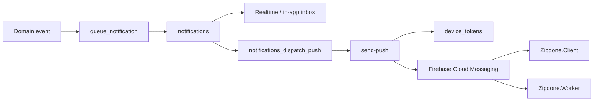

# ZipDone — уведомления и push

> Обновлено: 2026-07-11

## Поток



Production:

- migrations `push_delivery_pipeline` и `push_delivery_config` применены;
- `send-push` ACTIVE, `verify_jwt=false`;
- `PUSH_WEBHOOK_SECRET` проверяется функцией;
- для реальной доставки необходим `FIREBASE_SERVICE_ACCOUNT`;
- iOS production требует APNs Auth Key в Firebase.

## Хранилище

| Entity | Назначение |
|---|---|
| `notification_templates` | Event type и каналы по умолчанию |
| `notification_template_translations` | EN/AR title/body |
| `notifications` | Inbox и статус доставки |
| `notification_preferences` | Push/email/SMS/promotional preferences |
| `device_tokens` | FCM token пользователя и платформа |

## Device token lifecycle

Оба Flutter-приложения:

1. После успешной авторизации вызывают `upsert_device_token(p_fcm_token, p_platform)`.
2. Обновляют token после FCM refresh.
3. При logout или отключении push вызывают `remove_device_token(p_fcm_token)`.
4. Не регистрируют FCM на Flutter Web.

## Payload

Все значения FCM `data` передаются строками:

```json
{
  "notification_id": "uuid",
  "event_type": "order_accepted",
  "order_id": "uuid",
  "target_app": "client",
  "route": "/booking/<orderId>"
}
```

`target_app` обязателен: Client игнорирует payload Worker и наоборот.

## Навигация

| App | Event | Route |
|---|---|---|
| Client | `order_accepted`, `order_completed` | `/booking/:orderId` |
| Client | `dispute_opened`, `dispute_resolved` | `/support/:disputeId` или `/support` |
| Worker | `worker_assigned` | `/booking` до появления job detail |
| Worker | `new_cleaning_request` | `/home` |
| Оба | неизвестный event | `/notifications` |

Маршрут из payload разрешается только по allowlist. Произвольная внешняя ссылка не должна открываться без проверки.

## In-app inbox

- SELECT `notifications` ограничен `profile_id=auth.uid()` через RLS.
- `mark_notification_read` и `mark_all_notifications_read` изменяют только уведомления текущего профиля.
- Realtime подписка фильтруется по `profile_id`.
- После reconnect выполняется refetch.

## Firebase

Firebase project: `zipdone-af44e`.

| App | Android/iOS ID |
|---|---|
| Client | `com.zipdone.client` |
| Worker | `com.zipdone.worker` |

Firebase service-account JSON, APNs key и webhook secret не хранятся в документации или Git.
